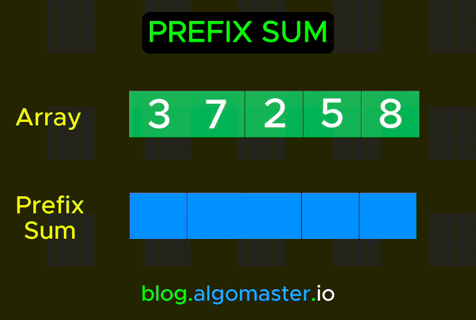

# Longest Balanced String Task (CS helwan 2025).

## psudo code
```
Function solve:
    Input: string s
    n ← length of s

   algorithm solve(s, n) // s is a string of length n
{
    ans := 0;
    // initialize variable answer to minmum possible value can be answer.
    // As we will maximize the length with the variable ans.

    for j := 1 to n - 1 step 1 do
        // loop from 1 to n, to try all possible windows from 1, 2, ... to n
        l := 0;
        r := j;
        // init two variable l.(left) and r.(right) they form the length of the window.

        while r < n do
            // loop to move the window step by step. (from left to right).
            // in each step we will loop inside the window.
            
            freq[256] := array of zeros;
            // init array to memorize each letter with its frequency.

            for i := l to r step 1 do
                // loop inside the window to memorize. .
                freq[ ASCII(s[i]) ] := freq[ ASCII(s[i]) ] + 1;

            // Check window status.
            count := 0;
            val1 := 0;
            val2 := 0;

            for i := 0 to 255 step 1 do
                // loop on frequency array to count unique letters.
                if freq[i] ≠ 0 then
                    count := count + 1;
                    if count = 1 then
                        val1 := freq[i]; // here we get first char
                    else if count = 2 then
                        val2 := freq[i]; // here we get second char
                    else
                        break; // here we find more than two char !

            if count = 2 then
                // this means that it contains only two different letters,
                // perhaps with different frequencies.
                if val1 = val2 then
                    // this means that it contains two different letters with the quale frequency,
                    // and it's valid window.
                    ans := max(ans, r - l + 1);
                    // here, we maximize the length of the valid windows.

            r := r + 1;
            l := l + 1;
            // here, we increament l and r to move the window by one.

    return ans;
    // print the ans, it contains the maximum length of Balanced String.
} 

```
## Implementation with c language.
```c

int max (int a, int b) {
    return a > b ? a : b;
}

void solve() {
    const int max_size = 1e5;
    char s[max_size]; // init char array.
    scanf("%s", s); // read input string.
    int n = strlen(s); // get the length of the string.

    int ans = 0; // init variable with minimum possible answer.
    for (int j = 1; j < n; j++) { // loop to try all lengthes from 1 to n
        int l = 0, r = j; // l --> (left) r --> (right) boundary of the substring.
        while (r < n) { // Move the window (subString) along the whole string.
            int freq[256] = {0}; // init array with size maximum ASCII Code.

            for (int i = l; i <= r; i++) { // loop inside the current window (subString)
                freq[s[i]]++;
            }

            int count = 0, val1 = 0, val2 = 0;
            // init three var, count to count the unique letters.
            // val1 to save the frequency of first char.
            // val2 to save the frequency of second char.
            for (int i = 0; i < 256; i++) { // loop inside the frequency array.
                if (freq[i]) {
                    count++; // find new char
                    if (count == 1) // first char
                        val1 = freq[i]; // Save character repetition
                    else if (count == 2) // second char
                        val2 = freq[i]; // Save character repetition
                    else // third char, it make the window not valid, break.
                        break;
                }
            }

            if (count == 2) { // this means it contain only two diff letter.
                if (val1 == val2) { // This means that their frequency is equal.
                    ans = max (ans, r - l + 1); // maximuze the answer.
                }
            }
            r++; l++; // increament the left and right to move the window.
        }
    }
    printf("%d\n", ans); // print answer.
}

```

## Analysis

The function `solve()` scans a C‑string `s` (length `n`) and finds the longest substring (“window”) containing **exactly two distinct characters**, each occurring the **same number of times**. It works as follows:

1. **Try every window length** `j = 1…n–1`.  
2. **Slide** a window of length `j+1` from `l=0, r=j` up to `r=n–1`.
    here is a simulation for sliding window.

.
   

4. **Count frequencies** inside the current window by:
   - Zeroing out a fixed array `freq[256]`.  
   - Scanning the window (`i = l…r`) and doing `freq[(unsigned char)s[i]]++`.  
5. **Scan** `freq[ ]` (size 256) to check if there are exactly two nonzero entries with equal counts.  
6. **Update** `ans` if the window is “balanced.”

---

### Time Complexity

- **Outer loop** over window lengths `j`: **O(n)**  
- **Sliding loop** for each `j`: **O(n)**  
- **Per-window work**:
  - Counting window characters: **O(j)**
  - Scanning `freq[256]`: **O(1)** (constant)

Sum over j=1..n-1 of [ O(n) * (O(j) + O(1)) ]
  = Sum over j=1..n-1 of O(n*j)
  = O( n * (n(n-1)/2) )
  = O(n^3)


**Time Complexity:** **O(n³)**

---

### Space Complexity

- **Input string** `s`: **O(n)**  
- **Frequency array** `freq[256]`: **O(1)** (constant)  
- **Scalars** (`ans, j, l, r, count, val1, val2, i`): **O(1)**  

**Space Complexity:** **O(n)** (dominated by the input string)  

---

# Balanced Substring Algorithm (CS helwan 2025).

## Pseudo code
```
Function solve:
    Input: string s
    n ← length of s

   algorithm solve(s, n) // s is a string of length n
{
    ans := 0;
    // initialize variable answer to minimum possible value.
    // We will maximize the length with the variable ans.

    for c1 := 'a' to 'z' step 1 do
        // Try all possible pairs of lowercase letters
        for c2 := c1 + 1 to 'z' step 1 do
            // Try all pairs where c2 > c1 to avoid duplicates
            
            i := 0;
            while i < n do
                // Skip characters that aren't c1 or c2
                while i < n AND s[i] ≠ c1 AND s[i] ≠ c2 do
                    i := i + 1;
                
                // Process the segment containing only c1 and c2
                firstIdx := empty hashmap;
                firstIdx[0] := 0;
                sum := 0;
                len := 0;
                
                while i + len < n AND (s[i + len] = c1 OR s[i + len] = c2) do
                    // Increment sum by 1 for c1, decrement by 1 for c2
                    if s[i + len] = c1 then
                        sum := sum + 1;
                    else
                        sum := sum - 1;
                    
                    len := len + 1;
                    
                    // If we haven't seen this sum before, record its first occurrence
                    if sum is not in firstIdx then
                        firstIdx[sum] := len;
                    else
                        // If we've seen this sum before, we have a balanced substring
                        ans := max(ans, len - firstIdx[sum]);
                
                i := i + len;  // Move to the next segment
    
    return ans;
    // Return the maximum length of balanced substring
}
```

## Implementation with C++ language.
```cpp
#include <iostream>
#include <string>
#include <unordered_map>
using namespace std;

int max (int a, int b) {
    return a > b ? a : b;
}

void solve() {
    string s;
    cin >> s;
    int n = s.size(), ans = 0;
    // Enumerate all pairs of distinct lowercase letters
    for (char c1 = 'a'; c1 <= 'z'; ++c1) {
        for (char c2 = c1 + 1; c2 <= 'z'; ++c2) {
            int i = 0;
            while (i < n) {
                // Skip chars outside {c1,c2}
                while (i < n && s[i] != c1 && s[i] != c2)
                    ++i;
                // Process the segment
                unordered_map<int,int> firstIdx;
                firstIdx[0] = 0;
                int sum = 0, len = 0;
                while (i + len < n && (s[i + len] == c1 || s[i + len] == c2)) {
                    sum += (s[i + len] == c1 ? 1 : -1);
                    ++len;
                    if (!firstIdx.count(sum))
                        firstIdx[sum] = len;
                    else
                        ans = max(ans, len - firstIdx[sum]);
                }
                i += len;
            }
        }
    }

    cout << ans;
}

int main() {
    solve();
    return 0;
}
```

## Analysis

The function `solve()` takes a string `s` (length `n`) and finds the longest substring containing **exactly two distinct characters with equal frequency**. Unlike the previous algorithm which uses a sliding window approach, this algorithm uses a **prefix sum technique** for each pair of distinct characters. It works as follows:

1. **Try every possible pair of lowercase letters** `c1` and `c2` (where `c1 < c2`).
2. **Process the string** for each pair:
   - Skip characters that aren't `c1` or `c2`.
   - For segments containing only `c1` and `c2`, use a **running sum** approach:
     - Assign `+1` for `c1` and `-1` for `c2`.
     - If the running sum equals zero at any point, the substring is balanced.
     - If the same sum appears twice, the substring between those positions is balanced.



### Example:
With string "aabbaabb" and the pair (a,b):
- We assign +1 for 'a' and -1 for 'b'
- The running sum becomes: [1,2,1,0,1,2,1,0]
- When we see the sum 0, we know we have a balanced substring
- When we see a repeat sum (like 1 appearing multiple times), the substring between those positions is also balanced

---

### Time Complexity

- **Outer loops** over character pairs: **O(26²) = O(1)** (constant)
- **Processing the string** for each pair: **O(n)**
- **Hash map operations**: **O(1)** average case

**Overall Time Complexity:** **O(n)** for each pair, and since there are O(1) pairs, the total is **O(n)**

---

### Space Complexity

- **Input string** `s`: **O(n)**
- **Hash map** `firstIdx`: **O(n)** in the worst case
- **Scalars** (`n, ans, i, sum, len`): **O(1)**

**Space Complexity:** **O(n)**

---

### Key Differences from Previous Algorithm

1. **Approach**: Uses prefix sums instead of sliding windows
2. **Efficiency**: O(n) vs O(n³) time complexity
3. **Implementation**: Uses a hash map to track sum occurrences rather than frequency counting
4. **Character selection**: Explicitly tries all letter pairs rather than examining all substrings

---

## Comparison Between the Two Algorithms

| Feature                     | Sliding Window Algorithm       | Prefix Sum Algorithm          |
|-----------------------------|--------------------------------|--------------------------------|
| **Approach**                | Sliding window with frequency counting | Prefix sum with hash map       |
| **Time Complexity**         | O(n³)                         | O(n)                          |
| **Space Complexity**        | O(n)                          | O(n)                          |
| **Efficiency**              | Less efficient for large inputs | Highly efficient for large inputs |
| **Character Selection**     | Examines all substrings       | Explicitly tries all letter pairs |
| **Implementation Complexity** | Moderate                     | Slightly more complex          |
| **Use Case**                | Suitable for small strings    | Suitable for large strings     |

### Key Takeaways
- The **Sliding Window Algorithm** is simpler to understand and implement but becomes computationally expensive for larger strings due to its cubic time complexity.
- The **Prefix Sum Algorithm** is significantly faster and more efficient, especially for large inputs, but requires a deeper understanding of prefix sums and hash maps.
- For practical applications, the **Prefix Sum Algorithm** is generally preferred due to its linear time complexity.
- The choice of algorithm depends on the input size and the need for computational efficiency.