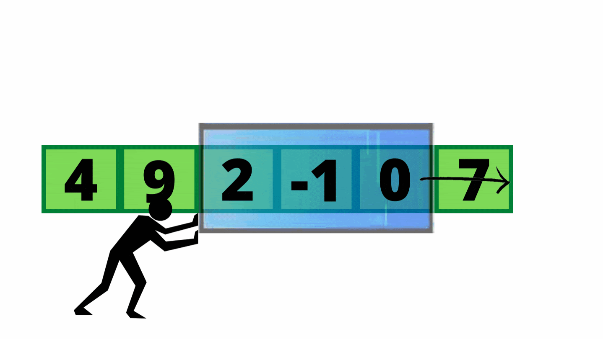

# Longest Balanced String Task (CS helwan 2025).

## psudo code
```
Function solve:
    Input: string s
    n ← length of s

   algorithm solve(s, n) // s is a string of length n
{
    ans := 0;
    // initialize variable answer to minmum possible value can be answer.
    // As we will maximize the length with the variable ans.

    for j := 1 to n - 1 step 1 do
        // loop from 1 to n, to try all possible windows from 1, 2, ... to n
        l := 0;
        r := j;
        // init two variable l.(left) and r.(right) they form the length of the window.

        while r < n do
            // loop to move the window step by step. (from left to right).
            // in each step we will loop inside the window.
            
            freq[256] := array of zeros;
            // init array to memorize each letter with its frequency.

            for i := l to r step 1 do
                // loop inside the window to memorize. .
                freq[ ASCII(s[i]) ] := freq[ ASCII(s[i]) ] + 1;

            // Check window status.
            count := 0;
            val1 := 0;
            val2 := 0;

            for i := 0 to 255 step 1 do
                // loop on frequency array to count unique letters.
                if freq[i] ≠ 0 then
                    count := count + 1;
                    if count = 1 then
                        val1 := freq[i]; // here we get first char
                    else if count = 2 then
                        val2 := freq[i]; // here we get second char
                    else
                        break; // here we find more than two char !

            if count = 2 then
                // this means that it contains only two different letters,
                // perhaps with different frequencies.
                if val1 = val2 then
                    // this means that it contains two different letters with the quale frequency,
                    // and it's valid window.
                    ans := max(ans, r - l + 1);
                    // here, we maximize the length of the valid windows.

            r := r + 1;
            l := l + 1;
            // here, we increament l and r to move the window by one.

    return ans;
    // print the ans, it contains the maximum length of Balanced String.
} 

```
## Implementation with c language.
```c

int max (int a, int b) {
    return a > b ? a : b;
}

void solve() {
    const int max_size = 1e5;
    char s[max_size]; // init char array.
    scanf("%s", s); // read input string.
    int n = strlen(s); // get the length of the string.

    int ans = 0; // init variable with minimum possible answer.
    for (int j = 1; j < n; j++) { // loop to try all lengthes from 1 to n
        int l = 0, r = j; // l --> (left) r --> (right) boundary of the substring.
        while (r < n) { // Move the window (subString) along the whole string.
            int freq[256] = {0}; // init array with size maximum ASCII Code.

            for (int i = l; i <= r; i++) { // loop inside the current window (subString)
                freq[s[i]]++;
            }

            int count = 0, val1 = 0, val2 = 0;
            // init three var, count to count the unique letters.
            // val1 to save the frequency of first char.
            // val2 to save the frequency of second char.
            for (int i = 0; i < 256; i++) { // loop inside the frequency array.
                if (freq[i]) {
                    count++; // find new char
                    if (count == 1) // first char
                        val1 = freq[i]; // Save character repetition
                    else if (count == 2) // second char
                        val2 = freq[i]; // Save character repetition
                    else // third char, it make the window not valid, break.
                        break;
                }
            }

            if (count == 2) { // this means it contain only two diff letter.
                if (val1 == val2) { // This means that their frequency is equal.
                    ans = max (ans, r - l + 1); // maximuze the answer.
                }
            }
            r++; l++; // increament the left and right to move the window.
        }
    }
    printf("%d\n", ans); // print answer.
}

```

## Analysis

The function `solve()` scans a C‑string `s` (length `n`) and finds the longest substring (“window”) containing **exactly two distinct characters**, each occurring the **same number of times**. It works as follows:

1. **Try every window length** `j = 1…n–1`.  
2. **Slide** a window of length `j+1` from `l=0, r=j` up to `r=n–1`.
    here is a simulation for sliding window.

.
   

4. **Count frequencies** inside the current window by:
   - Zeroing out a fixed array `freq[256]`.  
   - Scanning the window (`i = l…r`) and doing `freq[(unsigned char)s[i]]++`.  
5. **Scan** `freq[ ]` (size 256) to check if there are exactly two nonzero entries with equal counts.  
6. **Update** `ans` if the window is “balanced.”

---

### Time Complexity

- **Outer loop** over window lengths `j`: **O(n)**  
- **Sliding loop** for each `j`: **O(n)**  
- **Per-window work**:
  - Counting window characters: **O(j)**
  - Scanning `freq[256]`: **O(1)** (constant)

Sum over j=1..n-1 of [ O(n) * (O(j) + O(1)) ]
  = Sum over j=1..n-1 of O(n*j)
  = O( n * (n(n-1)/2) )
  = O(n^3)


**Time Complexity:** **O(n³)**

---

### Space Complexity

- **Input string** `s`: **O(n)**  
- **Frequency array** `freq[256]`: **O(1)** (constant)  
- **Scalars** (`ans, j, l, r, count, val1, val2, i`): **O(1)**  

**Space Complexity:** **O(n)** (dominated by the input string)  

